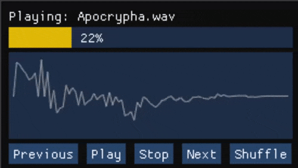

Music visualizer
========

> Simple and light media player for streaming services like Spotify.

* WIP 
  - Right now - Supported only WAV file
  - To develop 
    - Integrate Spotify 
    - Controls (Stop, Play, Switch\Select, Volume)
___

## Example of application window



## Getting Started

### Requirements

* ! `Your machine must have access to audio device` !
* ! `Windows x64 platform` !

### Dependencies for Running Locally
* cmake >= 3.8
  * All OSes: [click here for installation instructions](https://cmake.org/install/)
* make >= 4.1 (Linux, Mac), 3.81 (Windows)
  * Linux: make is installed by default on most Linux distros
  * Mac: [install Xcode command line tools to get make](https://developer.apple.com/xcode/features/)
  * Windows: [Click here for installation instructions](http://gnuwin32.sourceforge.net/packages/make.htm)
* VCPKG
  * For all platforms: [Download dependency tool](https://github.com/microsoft/vcpkg)

### Build and Run
All dependencies via [vcpkg.json](https://vcpkg.io/en/index.html) and managed in [vcpkg.json](vcpkg.json)

1. Open your editor like VS Code\Studio or CLion.
2. Depending on your setup, configure needed tools.
3. Compile
4. Run from CMD  `./MusicVisualizer -f test.wav` or `.\MusicVisualizer.exe -f .\test.wav`

A: `VS code\studio` set your `VCPKG_ROOT` in `CMakeSettings.json` to find libraries.
B: `CLion` in Build #CL-231.7864.77 have support of `VCPKG`

## Project structure
```
src
├── main.cpp    // Entry point
├── Audio       // Contains audio related implementation
├── Exception   // Application exceptions
└── Graphic     // Graphic related implementation
```
* Project based on SDL library so concrete implementation (wrappers) must be stored inside SDL folders, for example `Graphic/SDL`.

# TODO Rename project

## License
This project is licensed with the `MIT license`.
