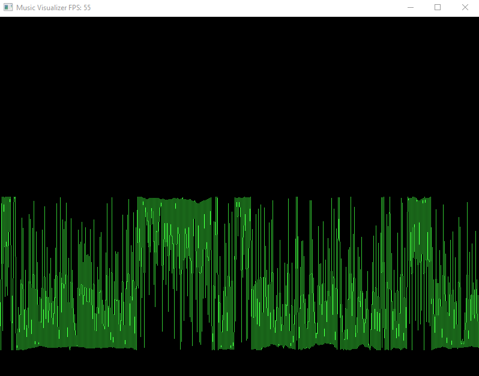

Music visualizer
========

> Program allows you to play audio file with wav format and show simple audio wave "visualisation".
___

## Example of application window



## Getting Started

### Requirements

! `Your machine must have access to audio device` !

Docker containers or virtual machines without audio will lead to application termination.

### Dependencies for Running Locally
* cmake >= 3.8
  * All OSes: [click here for installation instructions](https://cmake.org/install/)
* make >= 4.1 (Linux, Mac), 3.81 (Windows)
  * Linux: make is installed by default on most Linux distros
  * Mac: [install Xcode command line tools to get make](https://developer.apple.com/xcode/features/)
  * Windows: [Click here for installation instructions](http://gnuwin32.sourceforge.net/packages/make.htm)
* SDL2 >= 2.0
  * All installation instructions can be found [here](https://wiki.libsdl.org/Installation)
  * Note that for Linux, an `apt` or `apt-get` installation is preferred to building from source.
  * For Windows you will need download SDL2 manually and put it under `extern/SDL2`, [Click to get SDL2](https://www.libsdl.org/download-2.0.php)
* gcc/g++ >= 5.4
  * Linux: gcc / g++ is installed by default on most Linux distros
  * Windows: recommend using [MinGW](http://www.mingw.org/)

### Build and Run
1. Compile: `cd build && cmake .. && make`.
2. Run it `./MusicVisualizer -f test.wav`.

* `test.wav` contains audio of coffe machine but you can use own sounds.

## Project structure
```
src
├── main.cpp    // Entry point
├── Audio       // Contains audio related implementation
│   └── SDL
├── Exception   // Application exceptions
└── Graphic     // Graphic related implementation
    └── SDL
```
* Project based on SDL library so concreet implementation (wrappers) must be stored inside SDL folders, for example `Graphic/SDL`.

## Next to develop
```
- Fix issue with fast play for some wav files
- Add UI components to control player (Stop/play, volume, next, prev buttons etc)
- Update visualisation to be more relevant to audio wave, channel and frequency
```

#### Developet and tested under this platforms
- Windows 10 x64
- Debian GNU/Linux 10 (buster)

## License
This project is licensed with the `MIT license`.

