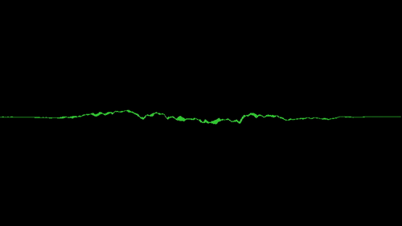

Music visualizer
========

> Program allows you to play audio file with wav format and show simple audio wave "visualisation".
___

## Example of application window



## Getting Started

### Requirements

* ! `Your machine must have access to audio device` !
* ! `Windows x64 platform` !

### Dependencies for Running Locally
* cmake >= 3.8
  * All OSes: [click here for installation instructions](https://cmake.org/install/)
* make >= 4.1 (Linux, Mac), 3.81 (Windows)
  * Linux: make is installed by default on most Linux distros
  * Mac: [install Xcode command line tools to get make](https://developer.apple.com/xcode/features/)
  * Windows: [Click here for installation instructions](http://gnuwin32.sourceforge.net/packages/make.htm)
* VCPKG
  * For all platforms: [Download dependency tool](https://github.com/microsoft/vcpkg)

### Build and Run
0. Get `SDL2` and `FFTW3`.
1. Compile: `cd build && cmake .. && make`.
2. Run it `./MusicVisualizer -f test.wav`.

* `test.wav` contains audio of coffee machine but you can use own sounds.
* `VS code\studio` set your `VCPKG_ROOT` in `CMakeSettings.json` to find libraries.

## Project structure
```
src
├── main.cpp    // Entry point
├── Audio       // Contains audio related implementation
├── Exception   // Application exceptions
└── Graphic     // Graphic related implementation
```
* Project based on SDL library so concrete implementation (wrappers) must be stored inside SDL folders, for example `Graphic/SDL`.

## Next to Develop\Fix
```
- Handle controls for player (Stop/play, volume, next, prev buttons etc)
- Load multiple files as playlist
- Handle playlist play (order and shuffle)
- Support Linux platform again
- Experement with Spotify API
```

## License
This project is licensed with the `MIT license`.
